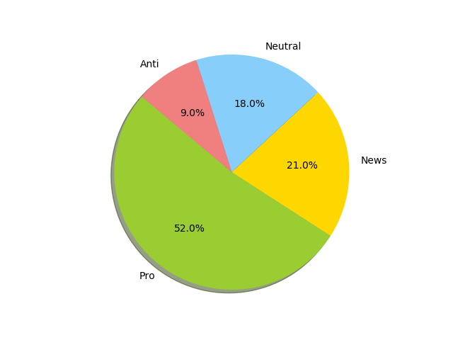

# Climate Change Belief Analysis Based on Twitter Data

The collection of this data was funded by a Canada Foundation for Innovation JELF Grant to Chris Bauch, University of Waterloo.

This dataset aggregates tweets pertaining to climate change collected between Apr 27, 2015 and Feb 21, 2018. In total, 43,943 tweets were annotated. Each tweet is labelled independently by 3 reviewers. This dataset only contains tweets that all 3 reviewers agreed on (the rest were discarded).

## About the dataset

We have three variables or columns:

- sentiment: Sentiment of tweet, the class it belongs to.
- message: Tweet body.
- tweetid: Twitter unique id.

*Extract from our dataset:*

| sentiment | message | tweetid |
| --- | --- | ---: |
2 |"RT @cnalive: Pranita Biswasi, a Lutheran from Odisha, gives testimony on effects of climate change &amp	 natural disasters on the po…" | 793125156185137153 |
1 |"RT @Mick_Fanning: Just watched this amazing documentary by leonardodicaprio on climate change. We all think this… https://t.co/kNSTE8K8im" | 793124635873275904 |
0 |"Unamshow awache kujinga na iko global warming https://t.co/mhIflU7M1X" | 793125429418815489 |
-1 |"@tiniebeany climate change is an interesting hustle as it was global warming but the planet stopped warming for 15 yes while the suv boom" | 792927353886371840 |
| |  |  |

Each tweet is labelled as one of the following classes:

- **2(News):** the tweet links to factual news about climate change
- **1(Pro):** the tweet supports the belief of man-made climate change
- **0(Neutral):** the tweet neither supports nor refutes the belief of man-made climate change
- **-1(Anti):** the tweet does not believe in man-made climate change

## The distribution of the data

It is important to note that these classes are not balanced — we have unequal populations of each class. The following figure shows the distribution of the data:

We have divided this dataset into train, validation and test datasets. You can find more information about the data processing in the docs/data_processing.ipynb notebook.
